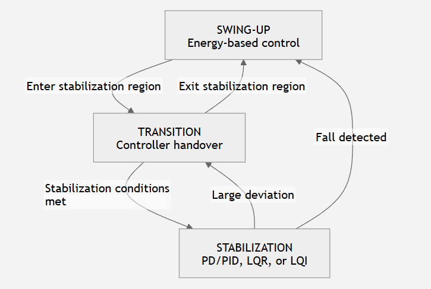

# Rotary Inverted Pendulum

Re-engineered embedded firmware and control software for the existing **Forest D1 rotary inverted pendulum**, using its original **Forest S1 STM32 controller module**.

> **A known-working plant is not the same thing as a known control system.**

This project is not primarily about proving that an STM32 can balance an inverted pendulum. The historical Forest mechanism already demonstrated that the physical plant can work. The purpose of this repository is to rebuild that system into a **measurable, testable, safety-gated, and progressively commissionable embedded control platform**.

The current hardware baseline is the original **Forest D1 baseboard and mechanism with its Forest S1 STM32F103C8T6 controller module (2016 revision)**. Hardware facts, sensor calibration, plant behavior, control computation, and physical actuator authority are treated as separate engineering properties and are validated independently.

Platform-independent control modules are developed and tested on the host before they are connected to real motor output.

## Design principles

1. **Measurement before control**  
   Hardware mappings, polarity, calibration, timing, dead zones, and plant response are established independently before closed-loop control is allowed to depend on them.

2. **Control computation is not actuator authority**  
   A valid controller output does not automatically grant permission to drive the physical motor.

3. **Fail closed**  
   Missing, stale, invalid, unqualified, or faulted state must reduce authority rather than preserve the last actuator command.

4. **Progressive commissioning**  
   The new control stack proceeds from passive observation to bounded maintenance actuation, characterization, observe-only control, admission, authority, and only then physical closed-loop control.

5. **Control logic remains platform-independent where practical**  
   Estimation, safety, configuration, and controller logic are kept separate from STM32-specific I/O so deterministic behavior can be tested on the host.

6. **Unknown is an acceptable engineering state; assumption is not evidence**  
   Historical behavior, source-file existence, or a plausible inference is not promoted into a current validation claim without supporting evidence.

7. **Safety is part of the control architecture**  
   Admission, watchdog behavior, motor ownership, output qualification, and safe loss of authority are architectural concerns rather than afterthoughts around the controller.

## System architecture

The system separates three questions that are often conflated in small embedded-control projects:

```text
STATE ESTIMATION
"What is the plant doing?"
        |
        v
CONTROL REGIME / COMPUTATION
"What control strategy applies, and what command should it produce?"
        |
        v
AUTHORITY & SAFETY
"May that command physically reach the motor?"
```

### State-estimation plane

```text
Physical Sensors
    -> Signal Acquisition
    -> Calibration / Wrapping
    -> Filtering / Estimation
    -> State Validity / Safety
    -> validated plant state
```

The estimator boundary supports interchangeable estimation strategies while keeping sensor acquisition, validation, and controller logic separated.

### Control plane

The rotary inverted pendulum is treated as a **mode-dependent / hybrid control problem**, not as one controller expected to work over the entire state space.



The control state machine separates the large-angle swing-up problem from local upright stabilization. **SWING-UP** uses energy-based control to drive the pendulum toward the upright equilibrium. **TRANSITION** manages controller handover after the state enters the stabilization region. **STABILIZATION** applies a local stabilizing controller such as PD/PID, LQR, or integral-augmented LQI.

Transitions are state-dependent and reversible. Leaving the stabilization region returns control to swing-up, while a moderate loss of stabilization can return the system to the transition state. A detected fall bypasses transition and returns directly to swing-up.

Controller availability and controller commissioning are intentionally separate concepts. The presence of a controller or estimator implementation does **not** mean that path is runtime-validated or physically commissioned.

Controllers operate behind a common state, safety, and actuator interface. A control mode can select a policy and compute an actuator request without gaining direct access to the motor.

### Authority and actuation plane

```text
Operator Intent
    -> Admission / Mode Management
    -> Continuous Run Permit
    -> Closed-loop Command Qualification
    -> Motor Authority Arbiter
    -> Watchdog / Safe-Shutdown Boundary
    -> board_motor
    -> rotary-arm motor
```

The **Control State Machine** owns controller-selection and mode-transition authority. The **Motor Authority Arbiter** owns physical actuator command authority. These responsibilities must not be conflated.

Motor authority is treated as an explicitly owned resource with `NONE / MAINTENANCE / CONTROL / FAULT` semantics.

### Safe-state contract

Loss of valid control authority must converge toward a defined motor-safe condition rather than preserving the previous actuator command.

Safe loss of authority may result from operator disable, invalid state, stale control output, runtime fault, authority conflict, watchdog expiration, or an independent emergency-stop path. Shutdown policy is enforced at the actuator-authority boundary so swing-up, transition logic, and all stabilization controllers share the same safety semantics.

The exact coast / brake / standby behavior belongs to the actuator and hardware contract rather than the controller itself.

See [Control Architecture](docs/architecture/control_architecture.md).

## Physical platform

Only hardware properties that directly shape the control architecture are summarized here:

- **Controller module:** Forest S1 with STM32F103C8T6 at 72 MHz, using bare-metal libopencm3.
- **Plant:** Forest D1 rotary inverted pendulum, 2016 hardware baseline.
- **Pendulum sensing:** analog angle sensor on **PA7 / ADC1_IN7**.
- **Rotary-arm sensing:** quadrature encoder; legacy hardware documentation specifies **1040 counts per output-shaft revolution**.
- **Actuation:** TB6612FNG H-bridge driving the rotary-arm DC motor.
- **Motor / gearing:** nominal 12 V DC motor with 1:20 gearbox on the original Forest mechanism.
- **Control timing:** 1 kHz firmware timing baseline.

The Forest S1 controller module is the direct-fit baseline for the existing Forest D1 baseboard. Pin-level wiring, user-interface connections, OLED signals, maintenance UART details, electrical notes, and validation checklists are kept in [Forest D1 2016 hardware baseline](docs/hardware/forest-d1-2016-baseline.md).

## Communication and ROS 2 integration

Communication remains outside the control core.

```text
                 Control / Estimation Core
                          |
                 native application state
                          |
              +-----------+-----------+
              |                       |
              v                       v
      Maintenance transport     ROS 2 / DDS integration
```

Transport and middleware must remain outside controller logic and must not implicitly confer actuator authority.

See [Communication and Parameter Architecture](docs/architecture/communications.md).

## Documentation

- [Control Architecture](docs/architecture/control_architecture.md)
- [Communication and Parameter Architecture](docs/architecture/communications.md)
- [Forest D1 2016 Hardware Baseline](docs/hardware/forest-d1-2016-baseline.md)
- [Commissioning Philosophy](docs/commissioning/commissioning-philosophy.md)
- [Firmware Commissioning](docs/commissioning/firmware-commissioning.md)
- [Motor Commissioning and Characterization](docs/commissioning/motor-characterization.md)
- [Repository Layout](docs/development/repository-layout.md)
- [Build and Test](docs/development/build-and-test.md)
- [Validation and Evidence Model](docs/validation/evidence-model.md)
