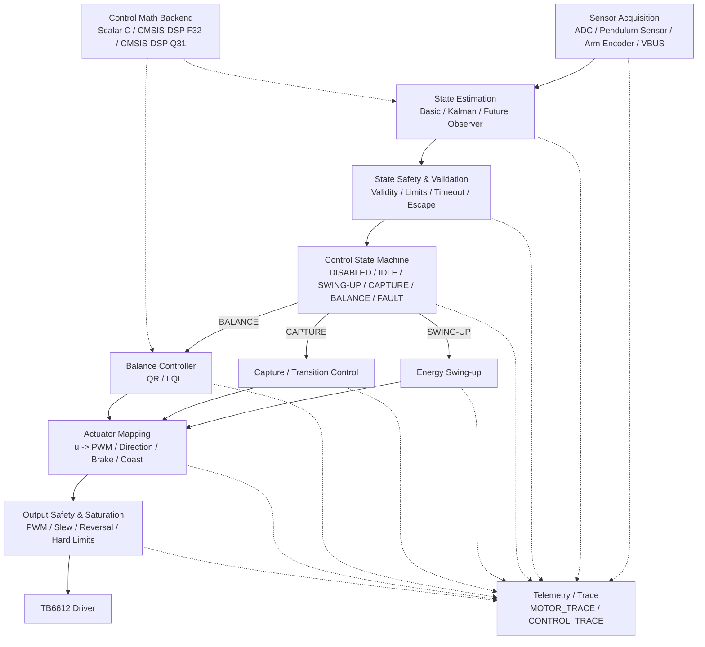

# Inverted Pendulum Control Architecture

## 1. Purpose

This document defines the target control architecture for the rotary inverted pendulum firmware.

The architecture is designed before all control functions are fully implemented. The key objective is to establish a complete, buildable, fail-safe topology with stable module boundaries. Individual algorithms may initially be implemented as safe stubs and replaced incrementally without restructuring the critical control path.

The architecture must support, at minimum:

- Sensor acquisition
- State estimation
- State validation and safety
- Control state-machine orchestration
- Energy swing-up
- Capture / transition control
- LQR balance control
- LQI balance control
- Actuator mapping
- Output safety and saturation
- TB6612 motor drive
- Telemetry and trace infrastructure
- Replaceable control-math backends, including CMSIS-DSP
- Future estimator extensions such as Kalman filtering

---

## 2. Architecture Principles

1. **Architecture topology must be fully defined early while retaining room for evolution.**
2. **The critical path must remain complete and must always have a valid implementation.**
3. **Critical modules must be easy to replace and extend.**
4. **Non-critical modules must be easy to replace, extend, and disable.**
5. **Algorithm implementations must remain separated from architecture boundaries.**
6. **Every supported configuration must remain buildable, linkable, and fail-safe.**

A complete architecture does not imply that every module must be fully implemented immediately. A module may initially use a safe/default implementation as long as its interface, position in the topology, build dependency, and failure behavior are already valid.

---

## 3. Module Categories

| Type | Replace | Extend | Disable | Examples |
|---|---:|---:|---:|---|
| **Critical Path Module** | Yes | Yes | No* | State Estimator, State Safety, Control State Machine, Actuator Mapper, Output Safety, Motor Driver |
| **Interchangeable Algorithm** | Yes | Yes | Individual implementation may be disabled | LQR, LQI, Basic Estimator, Kalman Estimator |
| **Conditional Control Module** | Yes | Yes | Yes / bypass | Energy Swing-up, Capture |
| **Supporting Module** | Yes | Yes | Yes | Telemetry, Trace, CMSIS-DSP acceleration, statistics, debug instrumentation |

> **Note:** A critical module must always have a valid implementation. While a safe/default implementation may be used before the full implementation is ready, pass-through behavior is only acceptable when it is semantically safe. Safety-related modules should fail closed rather than silently bypass protection. The topology itself must not be removed.

---

## 4. Target Runtime Architecture



The topology is fixed at the architectural level. Which algorithms are active at runtime is configuration-dependent.

---

## 5. Critical Control Path

The mandatory runtime path is:

```text
Sensor Acquisition
        ↓
State Estimation
        ↓
State Safety / Validation
        ↓
Control State Machine
        ↓
Selected Controller
        ↓
Actuator Mapping
        ↓
Output Safety / Saturation
        ↓
Motor Driver
```

Each block owns a distinct responsibility.

### 5.1 Sensor Acquisition

Responsible only for physical measurement acquisition and low-level timestamping.

Typical inputs:

- Pendulum sensor ADC
- Arm encoder count
- VBUS ADC
- Timing information

It must not implement balance-control policy.

### 5.2 State Estimation

Converts raw measurements into the control-domain state vector.

Nominal state definition:

\[
x =
\begin{bmatrix}
\theta & \dot{\theta} & \phi & \dot{\phi}
\end{bmatrix}^{T}
\]

where:

- `theta`: pendulum angle
- `theta_dot`: pendulum angular velocity
- `phi`: rotor-arm position relative to the defined reference
- `phi_dot`: rotor-arm angular velocity

The state-estimator interface remains constant even when the implementation changes from a basic finite-difference/filter implementation to Kalman filtering or another observer.

### 5.3 State Safety and Validation

Determines whether the measured/estimated state is valid enough for control.

Typical checks include:

- Sensor validity
- Timestamp freshness
- Finite-value checks
- Pendulum-angle limits
- Arm-position limits
- Velocity plausibility
- Escape conditions
- Control-loop timeout

State safety determines whether control is permitted; it does not directly generate PWM.

### 5.4 Control State Machine

Owns controller authority and mode transitions.

Expected modes:

```c
typedef enum
{
    CONTROL_MODE_DISABLED = 0,
    CONTROL_MODE_IDLE,
    CONTROL_MODE_SWING_UP,
    CONTROL_MODE_CAPTURE,
    CONTROL_MODE_BALANCE,
    CONTROL_MODE_FAULT
} control_mode_t;
```

The state machine decides which controller may produce the current control command.

It must not contain the internal mathematics of LQR, LQI, or swing-up algorithms.

### 5.5 Controller Selection

Controller implementations are replaceable algorithms behind stable interfaces.

Balance control is a critical function, but LQR and LQI are interchangeable implementations of that function.

```text
Balance Controller
    ├── LQR
    ├── LQI
    └── Future controller
```

Swing-up and capture are conditional control modules and may be bypassed when operating in manual-capture mode.

### 5.6 Actuator Mapping

Converts abstract control effort `u` into a hardware-independent actuator command.

Responsibilities may include:

- Control sign convention
- Control scaling
- Dead-zone compensation
- Direction selection
- PWM magnitude generation
- Minimum effective PWM
- Brake/coast policy
- Optional VBUS normalization

The controller must not directly manipulate TB6612 GPIO or PWM registers.

### 5.7 Output Safety and Saturation

Applies final constraints immediately before hardware output.

Typical responsibilities:

- PWM clamp
- Slew-rate limit
- Unsafe direction-reversal handling
- Hard arm-position limit
- Invalid-command rejection
- Fault-forced motor shutdown

If output safety cannot prove that a command is valid, it must fail closed.

### 5.8 Motor Driver

Provides the hardware-specific TB6612 implementation.

This layer owns:

- PWM peripheral access
- Direction GPIO control
- Brake/coast electrical behavior
- Safe-off behavior

Control algorithms must not depend on TB6612-specific details.

---

## 6. Control-State and Command Types

Architecture boundaries should use shared control-domain types rather than module-private representations.

Illustrative definitions:

```c
typedef struct
{
    uint32_t timestamp_us;

    int32_t pendulum_raw;
    int32_t arm_encoder_count;
    uint16_t vbus_adc_raw;

    bool valid;
} sensor_data_t;
```

```c
typedef struct
{
    float theta;
    float theta_dot;
    float phi;
    float phi_dot;

    bool valid;
} control_state_t;
```

```c
typedef struct
{
    float u;
    bool valid;
} control_command_t;
```

```c
typedef enum
{
    MOTOR_DIRECTION_NONE = 0,
    MOTOR_DIRECTION_LEFT,
    MOTOR_DIRECTION_RIGHT
} motor_direction_t;

typedef struct
{
    motor_direction_t direction;
    float pwm_percent;
    bool brake;
    bool valid;
} actuator_command_t;
```

These are architectural examples. Exact fields may evolve as system identification and hardware bring-up reveal additional requirements, but module responsibilities and direction of data flow should remain stable.

---

## 7. Pipeline Pseudocode

The top-level control loop should remain simple and orchestration-oriented.

```c
void control_pipeline_step(void)
{
    sensor_data_t sensor;
    control_state_t state;
    state_safety_result_t state_safety;
    control_command_t control;
    actuator_command_t actuator;

    /* 1. Measurement */
    sensor = sensor_acquisition_read();

    /* 2. State generation */
    state = state_estimator_step(&sensor);

    /* 3. State-level safety */
    state_safety = state_safety_check(&state, &sensor);

    /* 4. Mode orchestration */
    control_state_machine_step(&g_control_context,
                               &state,
                               &state_safety);

    /* 5. Active controller */
    control = controller_dispatch(&g_control_context,
                                  &state);

    /* 6. Convert control effort to actuator-domain command */
    actuator = actuator_mapper_step(&control,
                                    &state);

    /* 7. Final motor-output constraints */
    actuator = output_safety_apply(&actuator,
                                   &state,
                                   &state_safety);

    /* 8. Hardware output */
    if (g_control_context.motor_output_enabled)
        board_motor_apply(&actuator);
    else
        board_motor_safe_off();

    /* 9. Optional engineering observability */
    control_trace_push(&sensor,
                       &state,
                       &g_control_context,
                       &control,
                       &actuator,
                       &state_safety);
}
```

No individual control algorithm should change the topology of this function.

---

## 8. Controller Dispatch

The control state machine owns authority; the dispatcher selects the matching implementation.

```c
control_command_t controller_dispatch(
    control_context_t *ctx,
    const control_state_t *state)
{
    switch (ctx->mode)
    {
    case CONTROL_MODE_SWING_UP:
        return energy_swing_up_step(ctx, state);

    case CONTROL_MODE_CAPTURE:
        return capture_controller_step(ctx, state);

    case CONTROL_MODE_BALANCE:
        switch (ctx->balance_controller)
        {
        case BALANCE_CONTROLLER_LQI:
            return lqi_controller_step(ctx, state);

        case BALANCE_CONTROLLER_LQR:
        default:
            return lqr_controller_step(ctx, state);
        }

    case CONTROL_MODE_DISABLED:
    case CONTROL_MODE_IDLE:
    case CONTROL_MODE_FAULT:
    default:
        return control_command_zero();
    }
}
```

Controller authority must be explicit. Multiple controllers must not independently write to the motor output.

---

## 9. LQR and LQI

### 9.1 LQR

Nominal balance state:

\[
x = [\theta,\dot\theta,\phi,\dot\phi]^T
\]

Control law:

\[
u = -Kx
\]

The LQR implementation should depend on the control-math interface rather than directly depending on CMSIS-DSP.

### 9.2 LQI

LQI augments the balance state with an integral term:

\[
\xi_{k+1}=\xi_k+e_kT_s
\]

\[
x_{aug} =
[\theta,\dot\theta,\phi,\dot\phi,\xi]^T
\]

\[
u=-K_{aug}x_{aug}
\]

The integral target, gain, clamp, and anti-windup policy are implementation details and should not alter the balance-controller architecture boundary.

The state machine should govern integrator lifecycle, including reset, hold, enable, and fault behavior.

---

## 10. Swing-up and Capture

Swing-up and capture are conditional control modules.

A complete automatic operating path is expected to support:

```text
IDLE
  ↓
SWING_UP
  ↓
CAPTURE
  ↓
BALANCE
```

A manual-capture path may bypass swing-up and capture where appropriate:

```text
IDLE
  ↓
BALANCE
```

Bypass is a state-machine decision, not a removal of architecture interfaces.

---

## 11. Control Math Backend

Control algorithms should use a project-owned math abstraction instead of directly scattering CMSIS-DSP calls throughout controller code.

Example interface:

```c
float control_math_dot_f32(
    const float *a,
    const float *b,
    size_t length);
```

Possible backends:

```text
control_math
    ├── Scalar C
    ├── CMSIS-DSP F32
    └── CMSIS-DSP Q31
```

Candidate CMSIS-DSP usage includes:

- Dot products for LQR/LQI
- Matrix-vector multiplication for state-space observers
- Matrix operations for future Kalman implementations
- FIR / biquad filtering for state estimation
- Statistics for characterization and noise analysis
- FFT for optional onboard spectral analysis

CMSIS-DSP is an implementation backend, not a required architecture block. A valid scalar fallback should exist unless the selected build configuration explicitly requires CMSIS-DSP.

Performance-sensitive backend selection should be based on measured execution time, memory usage, and numerical behavior rather than library preference alone.

---

## 12. Telemetry and Trace

Telemetry and trace are supporting modules and must not be required for control-loop correctness.

They may be disabled without changing the critical path.

### 12.1 MOTOR_TRACE

Suggested fields:

```text
timestamp
phase
PWM
direction
encoder_count
velocity
VBUS
```

Primary use:

- Motor characterization
- Dead-zone measurement
- Left/right asymmetry
- Coasting and braking response
- System identification

### 12.2 CONTROL_TRACE

Suggested fields:

```text
timestamp
raw_sensor
theta
theta_dot
phi
phi_dot
integral_state
control_mode
u_raw
u_mapped
PWM
direction
safety_flags
VBUS
```

Primary use:

- LQR/LQI validation
- Swing-up tuning
- Capture-transition analysis
- State-estimator validation
- Fault analysis
- Model-to-hardware correlation

High-rate trace should not perturb the real-time control loop. Where necessary, samples should be stored in RAM and transmitted after the critical control action has completed.

---

## 13. Runtime Configuration vs Build Configuration

### 13.1 Runtime Configuration

Runtime-selectable behavior may include:

- Estimator mode
- Balance-controller mode
- Swing-up enable/bypass
- Capture enable/bypass
- Motor-output enable
- Telemetry enable

Example:

```c
typedef struct
{
    state_estimator_mode_t estimator_mode;
    balance_controller_t balance_controller;

    bool swing_up_enabled;
    bool capture_enabled;
    bool motor_output_enabled;
    bool telemetry_enabled;
} control_runtime_config_t;
```

### 13.2 Build Configuration

Compile-time configuration should be reserved for true build/platform concerns, such as:

- Hardware platform
- CMSIS-DSP availability
- Scalar/F32/Q31 math backend inclusion
- Host-test build
- Debug instrumentation

Algorithm enable/disable decisions should not be scattered across the codebase as unrelated preprocessor conditionals.

---

## 14. Safe Stub Policy

Incomplete modules are permitted, but their behavior must be explicit and safe.

### 14.1 Controller Stub

An unimplemented controller should return zero control effort.

```c
control_command_t energy_swing_up_step(...)
{
    return control_command_zero();
}
```

### 14.2 Estimator Stub

An unavailable estimator should return an invalid state rather than fabricated data.

```c
control_state_t kalman_estimator_step(...)
{
    return control_state_invalid();
}
```

### 14.3 Safety Stub

Safety must not default to permissive pass-through. If a safety implementation is incomplete or invalid, the system should force motor output off.

### 14.4 Unsupported Configuration

Unsupported configurations must fail explicitly during configuration validation, build, or initialization. They must not silently fall into undefined behavior.

---

## 15. Build and Integration Requirements

Architecture skeleton code is considered real only when it participates in the actual build.

The following requirements apply:

1. All active architecture modules must be compiled.
2. All required symbols must link successfully.
3. Existing host-side tests must continue to build and pass.
4. STM32 target firmware must continue to build successfully.
5. Default startup behavior must leave motor output disabled or in a defined safe state.
6. A valid runtime path must execute even when advanced modules remain stubs.
7. No architecture module may rely on hidden global side effects to bypass its declared interface.

A minimal valid runtime path is:

```text
Sensor Acquisition
        ↓
Basic State Estimator
        ↓
State Safety
        ↓
IDLE / zero-command control path
        ↓
Actuator Mapper
        ↓
Output Safety
        ↓
Motor Safe-Off
        ↓
Optional Trace
```

---

## 16. Suggested Repository Structure

The final repository organization may evolve, but the following structure reflects the architecture boundaries:

```text
control/
├── control_pipeline.c
├── control_pipeline.h
├── control_types.h
├── control_config.c
├── control_config.h
│
├── sensor_acquisition.c
├── sensor_acquisition.h
├── state_estimator.c
├── state_estimator.h
├── state_safety.c
├── state_safety.h
├── control_state_machine.c
├── control_state_machine.h
│
├── energy_swing_up.c
├── energy_swing_up.h
├── capture_controller.c
├── capture_controller.h
├── lqr_controller.c
├── lqr_controller.h
├── lqi_controller.c
├── lqi_controller.h
│
├── actuator_mapper.c
├── actuator_mapper.h
├── output_safety.c
├── output_safety.h
│
├── control_trace.c
├── control_trace.h
│
└── math/
    ├── control_math.h
    ├── control_math_scalar.c
    ├── control_math_cmsis_f32.c
    └── control_math_cmsis_q31.c
```

The existing project structure does not need to be reorganized wholesale in a single change. The important requirement is that ownership and module boundaries follow the architecture described here.

---

## 17. Architecture Review Checklist

Any new implementation or refactor should be reviewed against the following questions:

- Does the change preserve the critical path?
- Does the affected module still have one clear responsibility?
- Can the implementation be replaced without changing unrelated modules?
- If the module is non-critical, can it be disabled cleanly?
- Does the algorithm depend only on its architecture boundary rather than hardware details?
- Does an invalid or incomplete implementation fail safely?
- Does the selected configuration still build and link?
- Can the behavior be observed through trace/telemetry without affecting control correctness?
- Are state, coordinate, timing, and unit conventions explicit?
- Is hardware-specific behavior isolated below the actuator boundary?

---

## 18. Architectural Intent

The architecture is intended to support progressive replacement of implementations without repeated structural redesign.

Examples:

```text
Basic Estimator  <->  Kalman Estimator
LQR              <->  LQI
Scalar C         <->  CMSIS-DSP F32  <->  CMSIS-DSP Q31
Manual Capture   <->  Swing-up + Capture
Current Motor Backend <-> Future Actuator Backend
```

The architecture therefore aims for four properties:

> **Complete topology. Stable interfaces. Replaceable implementations. Buildable at every step.**

