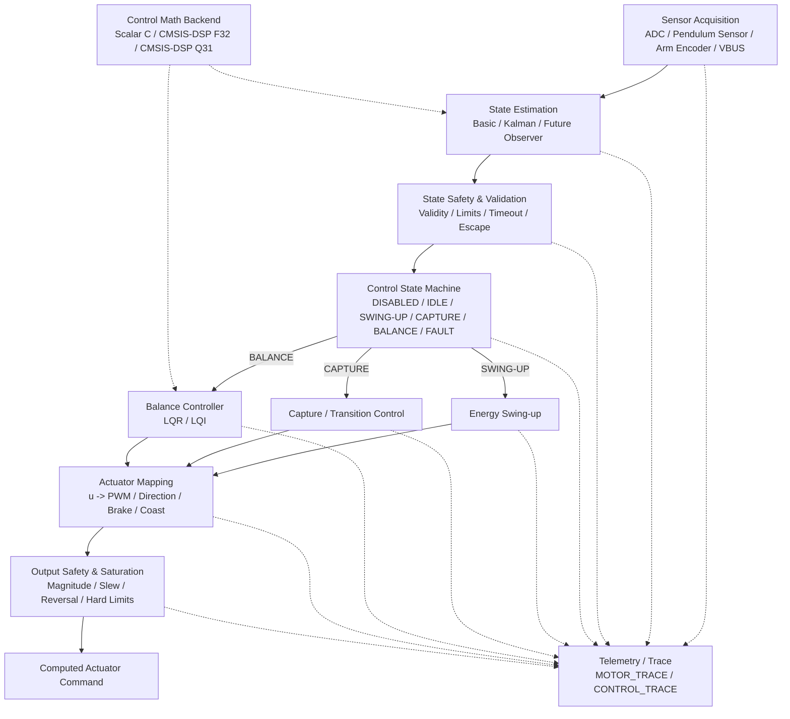
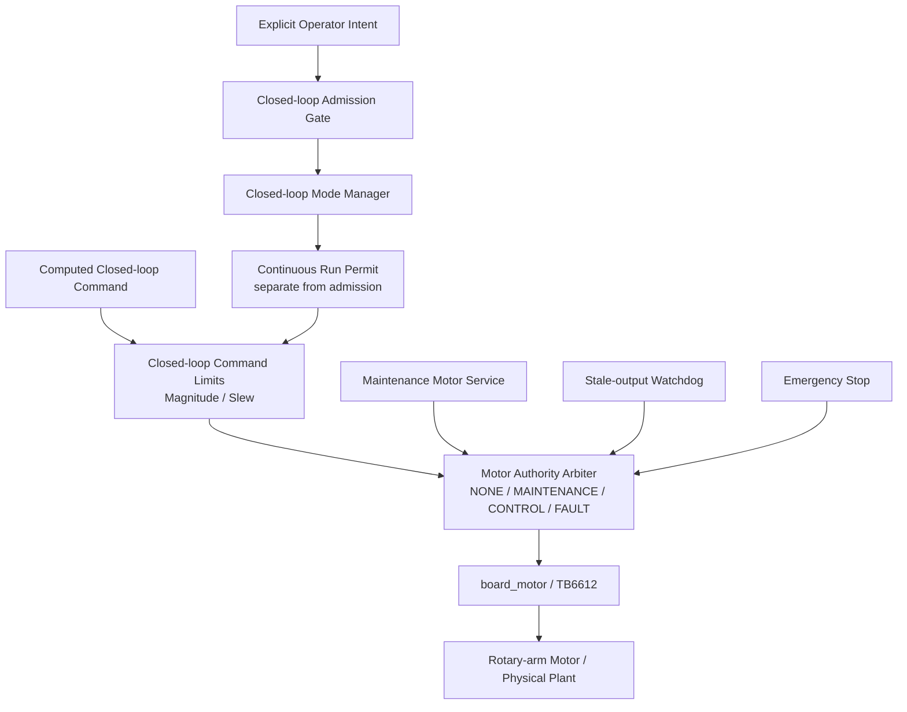

# Inverted Pendulum Control Architecture

## 1. Purpose

This document defines the target and current control architecture for the **rotary inverted pendulum** firmware.

The physical plant is the Forest S1 / Forest D1 rotary inverted-pendulum mechanism. The architecture described here is not a flight-control architecture: the controlled coordinates are the pendulum angle/rate and rotary-arm position/rate, and the actuator is the rotary-arm motor.

The architecture is designed before all control functions are fully implemented. The key objective is to establish a complete, buildable, fail-safe topology with stable module boundaries. Individual algorithms may initially be implemented as safe stubs and replaced incrementally without restructuring the critical control path.

The architecture must support, at minimum:

- Sensor acquisition
- State estimation
- State validation and safety
- Control state-machine orchestration
- Energy swing-up
- Capture / transition control
- LQR balance control
- LQI balance control
- Actuator mapping
- Output safety and saturation
- TB6612 motor drive
- Closed-loop admission and continuous run-permit safety
- Explicit physical motor-authority arbitration
- Stale-output watchdog and emergency-stop integration
- Telemetry and trace infrastructure
- Replaceable control-math backends, including CMSIS-DSP
- Future estimator extensions such as Kalman filtering

---

## 2. Architecture Principles

1. **Architecture topology must be fully defined early while retaining room for evolution.**
2. **The critical path must remain complete and must always have a valid implementation.**
3. **Critical modules must be easy to replace and extend.**
4. **Non-critical modules must be easy to replace, extend, and disable.**
5. **Algorithm implementations must remain separated from architecture boundaries.**
6. **Every supported configuration must remain buildable, linkable, and fail-safe.**
7. **Controller-selection authority and physical actuator authority are separate responsibilities.**
8. **Historical/legacy system validity must not be silently promoted into current implementation validity.**
9. **Source-file existence is not equivalent to runtime validation or physical commissioning.**

A complete architecture does not imply that every module must be fully implemented immediately. A module may initially use a safe/default implementation as long as its interface, position in the topology, build dependency, and failure behavior are already valid.

---

## 3. Module Categories

| Type | Replace | Extend | Disable | Examples |
|---|---:|---:|---:|---|
| **Critical Path Module** | Yes | Yes | No* | State Estimator, State Safety, Control State Machine, Actuator Mapper, Output Safety, Motor Driver |
| **Interchangeable Algorithm** | Yes | Yes | Individual implementation may be disabled | LQR, LQI, Basic Estimator, Kalman Estimator |
| **Conditional Control Module** | Yes | Yes | Yes / bypass | Energy Swing-up, Capture |
| **System Safety / Authority Module** | Yes | Yes | No when physical automatic control is enabled | Admission Gate, Run Permit, Motor Authority Arbiter, Watchdog, E-stop |
| **Supporting Module** | Yes | Yes | Yes | Telemetry, Trace, CMSIS-DSP acceleration, statistics, debug instrumentation |

> **Note:** A critical or system-safety module must always have a valid implementation when its dependent path is enabled. While a safe/default implementation may be used before the full implementation is ready, pass-through behavior is only acceptable when it is semantically safe. Safety-related modules should fail closed rather than silently bypass protection. The topology itself must not be removed.

---

## 4. Target Runtime Architecture

### 4.1 Control-computation architecture



This diagram answers **how a control command is computed**. It deliberately stops at a computed actuator command; it does not by itself grant permission to move the physical motor.

### 4.2 Physical actuation / safety-authority architecture



The **Control State Machine** owns controller-selection and mode-transition authority: it decides which control algorithm may produce the current computed command.

The **Motor Authority Arbiter** owns physical actuator command authority: it decides which owner, if any, may command `board_motor`.

These are intentionally different responsibilities:

```text
who may compute u
    !=
who may cause the rotary-arm motor to move
```

The arbiter must remain the single physical motor ownership boundary. Automatic control must never bypass it.

### 4.3 Current implemented actuation boundary

The current embedded runtime is intentionally observe-only for automatic control:

```text
control_pipeline
    -> controller / actuator command computation
    -> automatic motor sink = UNBOUND
```

The current physical actuation path is maintenance-only:

```text
UART / maintenance command
    -> motor_test_service
    -> Motor Authority Arbiter (MAINTENANCE)
    -> board_motor
    -> rotary-arm motor
```

The CONTROL owner, run-permit semantics, command limiter commissioning profile, and independent emergency-stop path must be validated before the automatic sink is bound.

### 4.4 Capability status terminology

Architecture diagrams define topology and target capability; they do not prove implementation maturity. Each capability should be described with one of these states when status matters:

| State | Meaning |
|---|---|
| **TARGET** | Intended architectural capability. |
| **STUB** | Interface/topology exists; behavior is intentionally incomplete, safe-zero, or invalid. |
| **IMPLEMENTED** | Current source code contains the implementation. |
| **HOST-VALIDATED** | Deterministic host-side tests support the implementation. |
| **RUNTIME-VALIDATED** | Exercised on the current embedded target with recorded runtime evidence. |
| **PHYSICALLY-COMMISSIONED** | Validated with the real plant and actuator under the required safety procedure. |

For example, source files for LQI, Kalman estimation, swing-up, or capture do not by themselves establish that those paths are runtime-validated or physically commissioned.

---

## 5. Critical Control Path

The target control-computation path is:

```text
Sensor Acquisition
        ↓
State Estimation
        ↓
State Safety / Validation
        ↓
Control State Machine
        ↓
Selected Controller
        ↓
Actuator Mapping
        ↓
Output Safety / Saturation
        ↓
Computed Actuator Command
```

Physical actuation, when eventually enabled for automatic control, continues through the system-level authority path:

```text
Computed Actuator Command
        ↓
Admission / Continuous Run Permission
        ↓
Closed-loop Output Limits
        ↓
Motor Authority Arbiter
        ↓
Watchdog / E-stop Enforcement
        ↓
Motor Driver
```

Each block owns a distinct responsibility.

### 5.1 Sensor Acquisition

Responsible only for physical measurement acquisition and low-level timestamping.

Typical inputs:

- Pendulum sensor ADC
- Arm encoder count
- VBUS ADC
- Timing information

It must not implement balance-control policy.

### 5.2 State Estimation

Converts raw measurements into the control-domain state vector.

Nominal state definition:

\[
x =
\begin{bmatrix}
\theta & \dot{\theta} & \phi & \dot{\phi}
\end{bmatrix}^{T}
\]

where:

- `theta`: pendulum angle
- `theta_dot`: pendulum angular velocity
- `phi`: rotary-arm position relative to the defined reference
- `phi_dot`: rotary-arm angular velocity

The state-estimator interface remains constant even when the implementation changes from a basic finite-difference/filter implementation to Kalman filtering or another observer.

### 5.3 State Safety and Validation

Determines whether the measured/estimated state is valid enough for control.

Typical checks include:

- Sensor validity
- Timestamp freshness
- Finite-value checks
- Pendulum-angle limits
- Arm-position limits
- Velocity plausibility
- Escape conditions
- Control-loop timeout

State safety determines whether control is permitted; it does not directly generate PWM and it does not itself grant physical motor ownership.

### 5.4 Control State Machine

Owns **controller-selection authority and mode transitions**.

Expected modes:

```c
typedef enum
{
    CONTROL_MODE_DISABLED = 0,
    CONTROL_MODE_IDLE,
    CONTROL_MODE_SWING_UP,
    CONTROL_MODE_CAPTURE,
    CONTROL_MODE_BALANCE,
    CONTROL_MODE_FAULT
} control_mode_t;
```

The state machine decides which controller may produce the current control command. It does not own the physical motor; physical ownership is mediated by the Motor Authority Arbiter.

It must not contain the internal mathematics of LQR, LQI, or swing-up algorithms.

### 5.5 Controller Selection

Controller implementations are replaceable algorithms behind stable interfaces.

Balance control is a critical function, but LQR and LQI are interchangeable implementations of that function.

```text
Balance Controller
    ├── LQR
    ├── LQI
    └── Future controller
```

Swing-up and capture are conditional control modules and may be bypassed when operating in manual-capture mode.

### 5.6 Actuator Mapping

Converts abstract control effort `u` into a hardware-independent actuator command.

Responsibilities may include:

- Control sign convention
- Control scaling
- Dead-zone compensation
- Direction selection
- PWM magnitude generation
- Minimum effective PWM
- Brake/coast policy
- Optional VBUS normalization

The controller must not directly manipulate TB6612 GPIO or PWM registers.

### 5.7 Output Safety and Saturation

Applies final command-domain constraints before physical authority is considered.

Typical responsibilities:

- PWM / command magnitude clamp
- Slew-rate limit
- Unsafe direction-reversal handling
- Hard arm-position limit
- Invalid-command rejection
- Fault-forced zero command

If output safety cannot prove that a command is valid, it must fail closed.

### 5.8 Motor Authority and Driver

The Motor Authority Arbiter is the single writer boundary immediately above the hardware-specific motor driver. It separates maintenance, automatic CONTROL ownership, and fault handling.

The hardware-specific TB6612 layer owns:

- PWM peripheral access
- Direction GPIO control
- Brake/coast electrical behavior
- Safe-off behavior

Control algorithms must not depend on TB6612-specific details and must never call the hardware motor driver directly.

---

## 6. Control-State and Command Types

Architecture boundaries should use shared control-domain types rather than module-private representations.

Illustrative definitions:

```c
typedef struct
{
    uint32_t timestamp_us;

    int32_t pendulum_raw;
    int32_t arm_encoder_count;
    uint16_t vbus_adc_raw;

    bool valid;
} sensor_data_t;
```

```c
typedef struct
{
    float theta;
    float theta_dot;
    float phi;
    float phi_dot;

    bool valid;
} control_state_t;
```

```c
typedef struct
{
    float u;
    bool valid;
} control_command_t;
```

```c
typedef enum
{
    MOTOR_DIRECTION_NONE = 0,
    MOTOR_DIRECTION_LEFT,
    MOTOR_DIRECTION_RIGHT
} motor_direction_t;

typedef struct
{
    motor_direction_t direction;
    float pwm_percent;
    bool brake;
    bool valid;
} actuator_command_t;
```

These are architectural examples. Exact fields may evolve as system identification and hardware bring-up reveal additional requirements, but module responsibilities and direction of data flow should remain stable.

---

## 7. Pipeline Pseudocode

The platform-independent control pipeline should remain simple and orchestration-oriented. It computes a safe command but does not implicitly acquire physical motor authority.

```c
void control_pipeline_step(void)
{
    sensor_data_t sensor;
    control_state_t state;
    state_safety_result_t state_safety;
    control_command_t control;
    actuator_command_t actuator;

    /* 1. Measurement */
    sensor = sensor_acquisition_read();

    /* 2. State generation */
    state = state_estimator_step(&sensor);

    /* 3. State-level safety */
    state_safety = state_safety_check(&state, &sensor);

    /* 4. Mode orchestration */
    control_state_machine_step(&g_control_context,
                               &state,
                               &state_safety);

    /* 5. Active controller */
    control = controller_dispatch(&g_control_context,
                                  &state);

    /* 6. Convert control effort to actuator-domain command */
    actuator = actuator_mapper_step(&control,
                                    &state);

    /* 7. Final command-domain constraints */
    actuator = output_safety_apply(&actuator,
                                   &state,
                                   &state_safety);

    /* 8. Publish the computed command to the system-level sink interface. */
    control_output_publish(&actuator);

    /* 9. Optional engineering observability */
    control_trace_push(&sensor,
                       &state,
                       &g_control_context,
                       &control,
                       &actuator,
                       &state_safety);
}
```

The system-level runtime decides whether `control_output_publish()` is unbound, observe-only, or connected through the admission/run-permit and Motor Authority path. No individual control algorithm should change this topology or directly write the motor.

---

## 8. Controller Dispatch

The control state machine owns controller-selection authority; the dispatcher selects the matching implementation.

```c
control_command_t controller_dispatch(
    control_context_t *ctx,
    const control_state_t *state)
{
    switch (ctx->mode)
    {
    case CONTROL_MODE_SWING_UP:
        return energy_swing_up_step(ctx, state);

    case CONTROL_MODE_CAPTURE:
        return capture_controller_step(ctx, state);

    case CONTROL_MODE_BALANCE:
        switch (ctx->balance_controller)
        {
        case BALANCE_CONTROLLER_LQI:
            return lqi_controller_step(ctx, state);

        case BALANCE_CONTROLLER_LQR:
        default:
            return lqr_controller_step(ctx, state);
        }

    case CONTROL_MODE_DISABLED:
    case CONTROL_MODE_IDLE:
    case CONTROL_MODE_FAULT:
    default:
        return control_command_zero();
    }
}
```

Controller-selection authority must be explicit. Multiple controllers must not independently write to the physical motor output.

---

## 9. LQR and LQI

### 9.1 LQR

Nominal balance state:

\[
x = [\theta,\dot\theta,\phi,\dot\phi]^T
\]

Control law:

\[
u = -Kx
\]

The LQR implementation should depend on the control-math interface rather than directly depending on CMSIS-DSP.

### 9.2 LQI

LQI augments the balance state with an integral term:

\[
\xi_{k+1}=\xi_k+e_kT_s
\]

\[
x_{aug} =
[\theta,\dot\theta,\phi,\dot\phi,\xi]^T
\]

\[
u=-K_{aug}x_{aug}
\]

The integral target, gain, clamp, and anti-windup policy are implementation details and should not alter the balance-controller architecture boundary.

The state machine should govern integrator lifecycle, including reset, hold, enable, and fault behavior.

---

## 10. Swing-up and Capture

Swing-up and capture are conditional control modules.

A complete automatic operating path is expected to support:

```text
IDLE
  ↓
SWING_UP
  ↓
CAPTURE
  ↓
BALANCE
```

A manual-capture path may bypass swing-up and capture where appropriate:

```text
IDLE
  ↓
BALANCE
```

Bypass is a state-machine decision, not a removal of architecture interfaces.

The current observe-only commissioning path uses `DISABLED -> IDLE -> BALANCE` to prove legitimate admission semantics without binding the motor. That does not remove the future swing-up/capture topology.

---

## 11. Control Math Backend

Control algorithms should use a project-owned math abstraction instead of directly scattering CMSIS-DSP calls throughout controller code.

Example interface:

```c
float control_math_dot_f32(
    const float *a,
    const float *b,
    size_t length);
```

Possible backends:

```text
control_math
    ├── Scalar C
    ├── CMSIS-DSP F32
    └── CMSIS-DSP Q31
```

Candidate CMSIS-DSP usage includes:

- Dot products for LQR/LQI
- Matrix-vector multiplication for state-space observers
- Matrix operations for future Kalman implementations
- FIR / biquad filtering for state estimation
- Statistics for characterization and noise analysis
- FFT for optional onboard spectral analysis

CMSIS-DSP is an implementation backend, not a required architecture block. A valid scalar fallback should exist unless the selected build configuration explicitly requires CMSIS-DSP.

Performance-sensitive backend selection should be based on measured execution time, memory usage, and numerical behavior rather than library preference alone.

---

## 12. Telemetry and Trace

Telemetry and trace are supporting modules and must not be required for control-loop correctness or safety decisions.

They may be disabled without changing the critical path. Admission/run-permit logic must consume dedicated runtime status rather than optional trace data.

### 12.1 MOTOR_TRACE

Suggested fields:

```text
timestamp
phase
PWM
direction
encoder_count
velocity
VBUS
```

Primary use:

- Motor characterization
- Dead-zone measurement
- Left/right asymmetry
- Coasting and braking response
- System identification

### 12.2 CONTROL_TRACE

Suggested fields:

```text
timestamp
raw_sensor
theta
theta_dot
phi
phi_dot
integral_state
control_mode
u_raw
u_mapped
PWM
direction
safety_flags
admission_flags
run_permit_flags
motor_authority
VBUS
```

Primary use:

- LQR/LQI validation
- Swing-up tuning
- Capture-transition analysis
- State-estimator validation
- Fault analysis
- Admission / run-permit analysis
- Model-to-hardware correlation

High-rate trace should not perturb the real-time control loop. Where necessary, samples should be stored in RAM and transmitted after the critical control action has completed.

---

## 13. Runtime Configuration vs Build Configuration

### 13.1 Runtime Configuration

Runtime-selectable behavior may include:

- Estimator mode
- Balance-controller mode
- Swing-up enable/bypass
- Capture enable/bypass
- Operator control request / mode-management state
- Commissioning output-limit profile
- Telemetry enable

Physical automatic motor binding must not be treated as an ordinary permissive runtime toggle before the safety architecture is commissioned.

### 13.2 Build Configuration

Compile-time configuration should be reserved for true build/platform concerns, such as:

- Hardware platform
- CMSIS-DSP availability
- Scalar/F32/Q31 math backend inclusion
- Host-test build
- Debug instrumentation

Algorithm enable/disable decisions should not be scattered across the codebase as unrelated preprocessor conditionals.

---

## 14. Safe Stub Policy

Incomplete modules are permitted, but their behavior must be explicit and safe.

### 14.1 Controller Stub

An unimplemented controller should return zero control effort.

```c
control_command_t energy_swing_up_step(...)
{
    return control_command_zero();
}
```

### 14.2 Estimator Stub

An unavailable estimator should return an invalid state rather than fabricated data.

```c
control_state_t kalman_estimator_step(...)
{
    return control_state_invalid();
}
```

### 14.3 Safety Stub

Safety must not default to permissive pass-through. If a safety implementation or required configuration is incomplete or invalid, the physical automatic-control path must remain blocked.

### 14.4 Unsupported Configuration

Unsupported configurations must fail explicitly during configuration validation, build, or initialization. They must not silently fall into undefined behavior.

---

## 15. Build and Integration Requirements

Architecture skeleton code is considered real only when it participates in the actual build.

The following requirements apply:

1. All active architecture modules must be compiled.
2. All required symbols must link successfully.
3. Existing host-side tests must continue to build and pass.
4. STM32 target firmware must continue to build successfully.
5. Default startup behavior must leave physical automatic motor output disabled or unbound.
6. A valid runtime path must execute even when advanced modules remain stubs.
7. No architecture module may rely on hidden global side effects to bypass its declared interface.
8. Physical motor writes must pass through the Motor Authority Arbiter.
9. Admission and continuous run-permit semantics must fail closed on unavailable or stale runtime status.
10. Safety and performance changes require reproducible build/runtime evidence before commissioning status is advanced.

A minimal valid observe-only runtime path is:

```text
Sensor Acquisition
        ↓
Basic State Estimator
        ↓
State Safety
        ↓
IDLE / zero-command or selected-controller computation
        ↓
Actuator Mapper
        ↓
Output Safety
        ↓
Automatic Motor Sink UNBOUND
        ↓
Optional Trace
```

---

## 16. Suggested Repository Structure

The final repository organization may evolve, but the following structure reflects the architecture boundaries:

```text
app/
├── closed_loop_enable_gate.c
├── closed_loop_gate_runtime.c
├── closed_loop_mode_manager.c
├── motor_authority.c
└── system-level runtime adapters

control/
├── control_pipeline.c
├── control_pipeline.h
├── control_types.h
├── control_config.c
├── control_config.h
│
├── sensor_acquisition.c
├── sensor_acquisition.h
├── state_estimator.c
├── state_estimator.h
├── state_safety.c
├── state_safety.h
├── control_state_machine.c
├── control_state_machine.h
│
├── energy_swing_up.c
├── energy_swing_up.h
├── capture_controller.c
├── capture_controller.h
├── lqr_controller.c
├── lqr_controller.h
├── lqi_controller.c
├── lqi_controller.h
│
├── actuator_mapper.c
├── actuator_mapper.h
├── output_safety.c
├── output_safety.h
│
├── control_trace.c
├── control_trace.h
│
└── math/
    ├── control_math.h
    ├── control_math_scalar.c
    ├── control_math_cmsis_f32.c
    └── control_math_cmsis_q31.c
```

The existing project structure does not need to be reorganized wholesale in a single change. The important requirement is that ownership and module boundaries follow the architecture described here.

---

## 17. Architecture Review Checklist

Any new implementation or refactor should be reviewed against the following questions:

- Does the change preserve the control-computation critical path?
- Does it preserve the physical actuator-authority boundary?
- Does the affected module still have one clear responsibility?
- Can the implementation be replaced without changing unrelated modules?
- If the module is non-critical, can it be disabled cleanly?
- Does the algorithm depend only on its architecture boundary rather than hardware details?
- Does an invalid or incomplete implementation fail safely?
- Does the selected configuration still build and link?
- Can the behavior be observed through trace/telemetry without affecting control correctness?
- Are state, coordinate, timing, and unit conventions explicit?
- Is hardware-specific behavior isolated below the actuator boundary?
- Is controller-selection authority clearly separated from physical motor authority?
- Are admission-only conditions kept separate from continuous run-permit conditions?
- Is the claimed maturity level TARGET/STUB/IMPLEMENTED/HOST-VALIDATED/RUNTIME-VALIDATED/PHYSICALLY-COMMISSIONED supported by evidence?
- Is each physical or safety-critical fact tagged with appropriate provenance rather than inferred from legacy behavior or source-file existence?

---

## 18. Current Project Position

As of the current architecture rebaseline, the project has passed the major observe-only foundations and is still deliberately before physical automatic motor binding.

```text
hardware / I/O bring-up                     validated foundation
maintenance motor path                      validated foundation
control computation architecture            integrated
observe-only runtime                        integrated / runtime-validated
explicit observe-only state safety          runtime-validated
pipeline status independent of trace        runtime-validated
closed-loop admission gate                  runtime-validated in reject/pass prerequisites
legitimate mode transition                  implemented / host and build integrated; runtime validation active
admission vs continuous run permit          next architecture step
operator arm/enable/disable/status           planned
closed-loop magnitude / slew limiters        planned
independent emergency-stop path              planned
full observe-only gate/permit proof          planned
CONTROL motor-sink binding                   blocked until prerequisites pass
plant identification                         later commissioning work
PID / LQR physical commissioning             later commissioning work
```

This ordering is intentional. A controller being able to calculate a nonzero `u` is not permission to actuate the plant.

---

## 19. Architectural Intent

The architecture is intended to support progressive replacement of implementations without repeated structural redesign.

Examples:

```text
Basic Estimator  <->  Kalman Estimator
LQR              <->  LQI
Scalar C         <->  CMSIS-DSP F32  <->  CMSIS-DSP Q31
Manual Capture   <->  Swing-up + Capture
Current Motor Backend <-> Future Actuator Backend
```

The architecture therefore aims for five properties:

> **Complete topology. Stable interfaces. Replaceable implementations. Explicit actuator authority. Buildable and fail-safe at every step.**
